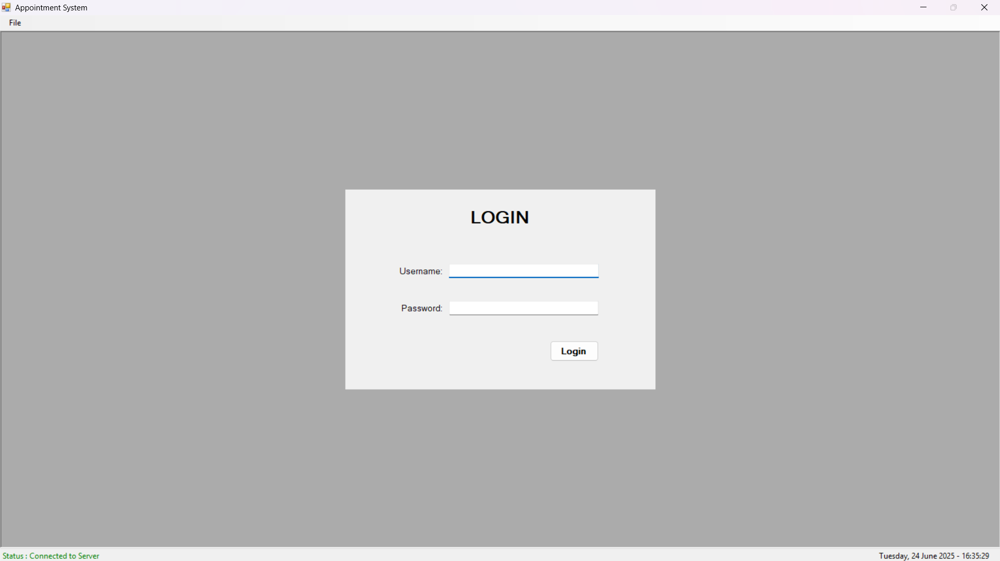
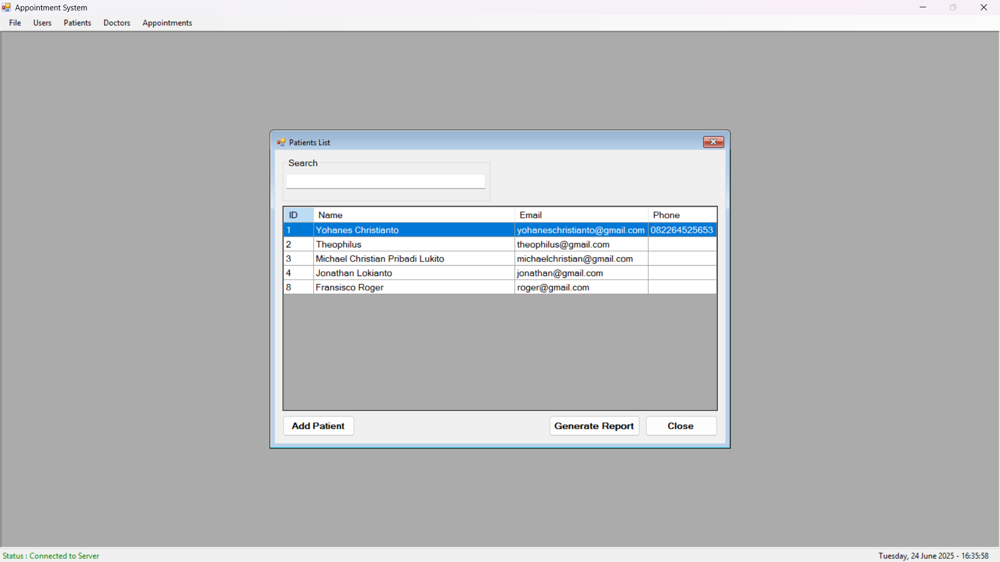
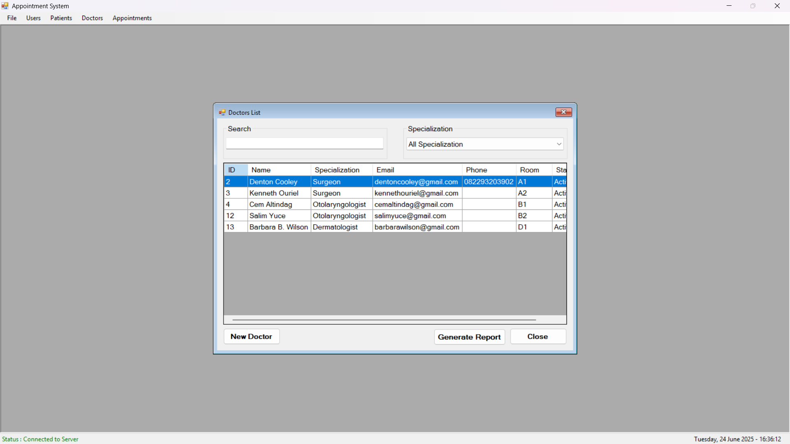
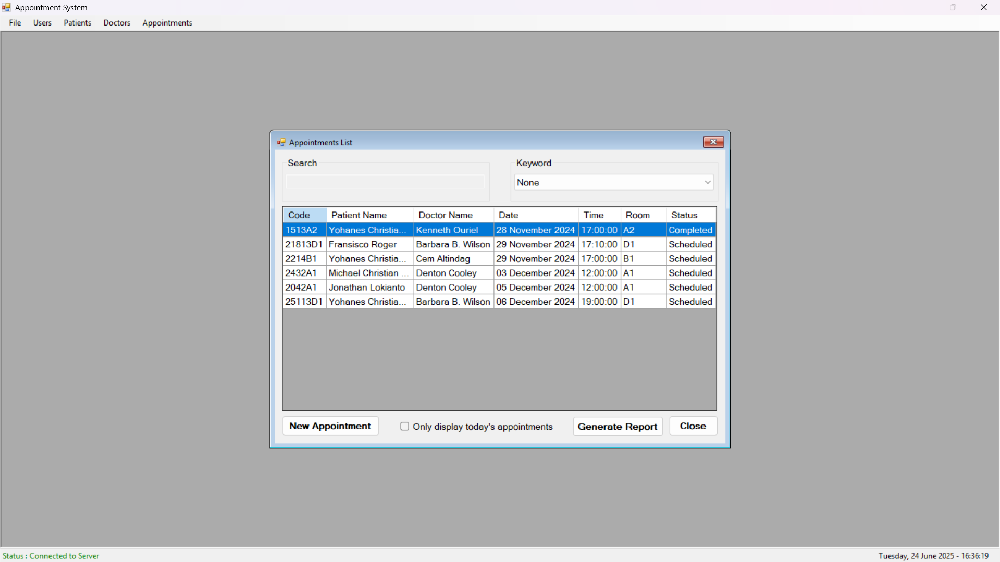
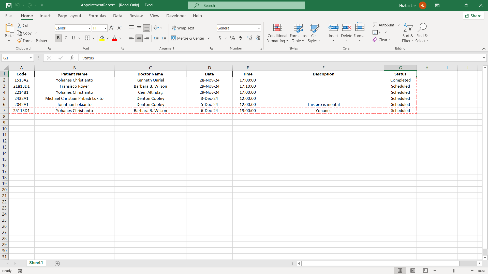

# Appointment System - Client-Server Programming Project

This repository contains the **Appointment System**, a college project developed for a Client-Server Programming course. This application is designed to manage appointments between doctors and patients, providing a comprehensive system for scheduling, viewing, and tracking appointments. It leverages Visual Basic .NET for its development.

## Introduction

The `Appointment System` is a desktop application built using Visual Basic .NET. It facilitates the management of a doctor's schedule and patient appointments, providing a user-friendly interface for various administrative tasks related to a clinic or hospital's appointment desk. The "client-server" aspect implies a backend database for data persistence, allowing multiple clients (if implemented) to access and modify shared data.

## Features

* **Doctors Management**: View a list of available doctors, including their specializations and contact information.

* **Patients Management**: Register and manage patient details, essential for scheduling appointments.

* **Appointment Scheduling**: Create, view, update, and cancel appointments between patients and doctors.

* **Appointment Tracking**: Differentiate between scheduled and completed appointments.

* **Login System**: Secure access for authorized users (e.g., clinic staff).

* **Generate Reports**: Export various system data into Excel format.

* **Database Integration**: Persistent storage for all system data.

## Technologies Used
* **Visual Studio**: The application used to create this project.

* **Visual Basic .NET (VB.NET)**: The primary programming language.

* **.NET Framework**: For building the Windows Forms application.

* **ADO.NET**: For database connectivity and data manipulation.

* **SQL Server**: For the backend database.

* **Microsoft.Office.Interop.Excel**: For generating Excel reports.

## App Preview
### Login

### Patients

### Doctors

### Appointments

### Report

